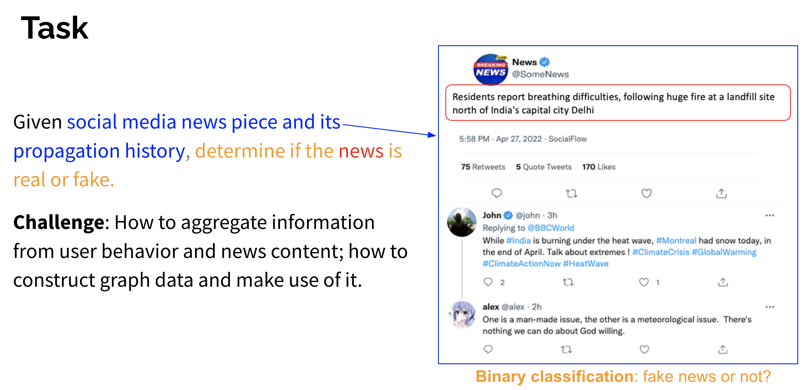
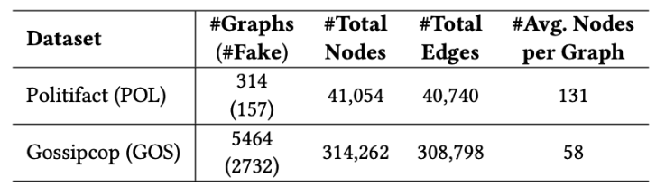
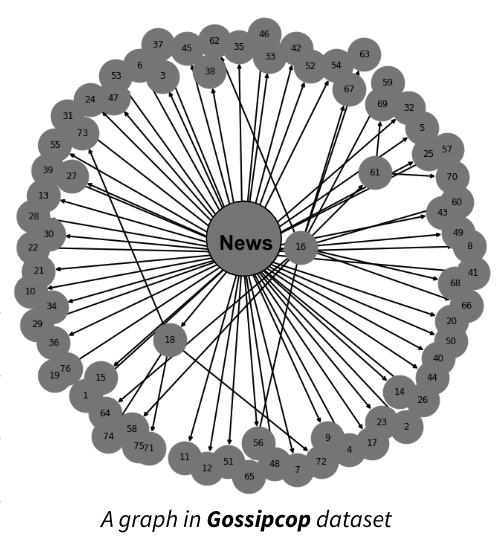
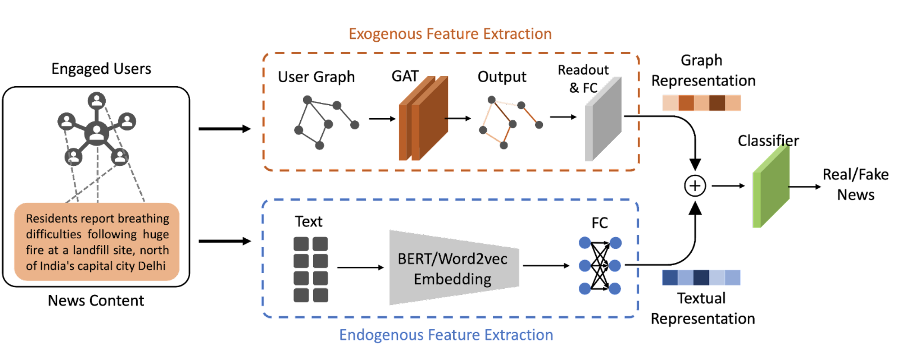
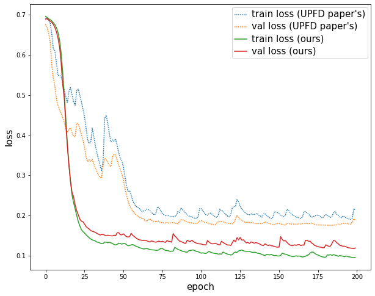
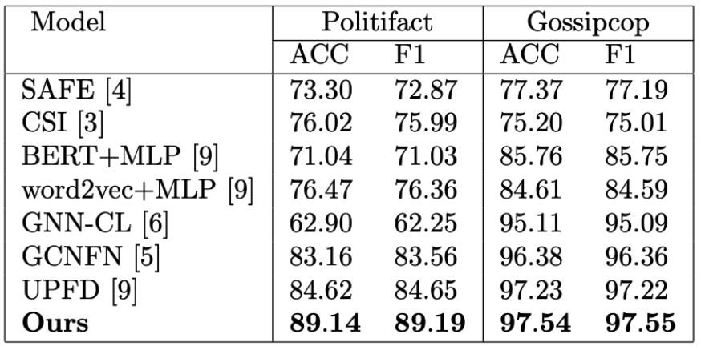

# A GNN-based model for Fake News Detection



# Setup

```
git clone git@github.com:chaudatascience/fake_news_detection_gnns.git
cd fake_news_detection_gnns
conda env create -f environment.yml
conda activate fake_news
```

# Usage
### To reproduce the results on the 2 datasets
```
sh run.sh
```


### To run from command line
```
python -m src.fake_news.fake_news_detection --dataset gossipcop --epochs 300 --early_stopping 50 --batch 128
```


**Arguments**
```
'--dataset', type=str, default="gossipcop",
                    help="name of the dataset, either 'gossipcop' or 'politifact' "
'--early_stopping', type=int, default=50,
                    help="stop training after `early_stopping` non-decreasing val loss epochs"
'--cuda', type=str, default="auto",
                    help="choose x for 'cuda:x', or using most available GPU by default"
'--batch', type=int, default=128,
                    help="batch size for training"
'--lr', type=float, default=0.001,
                    help="learning rate"
'--weight_decay', type=float, default=0.01,
                    help="weight decay for lr"
'--epochs', type=int, default=300,
                    help="training epochs"
'--dropout', type=float, default=0,
                    help="dropout"
'--pooling', type=str, default="global_max_pool",
                    help="one of [global_mean_pool, global_max_pool, global_attention, global_attention_with_relu, global_attention_with_relu_linear]"
'--gat_layer', type=str, default="GATConv",
                    help="one of ['OurGATNet', GATConv', 'GATv2Conv', 'SuperGATConv']"
'--hid_dims', type=List[int], default=[32],
                    help="hidden dimensions for GATs"
'--news_dim', type=int, default=64,
                    help="dimensions for news"
'--readout_dim', type=int, default=64,
                    help="dimensions for graph readout"
'--num_heads', type=int, default=1,
                    help="num attention heads for each GAT layer"
'--feature', type=str, default='content',
                    help="feature type: [profile, spacy, bert, content],`content` means 300-d word2vec+10-d profile"
'--only_gat', type=bool, default=False,
                        help="Only use GAT (testing purpose)"
```

For hyper-param tuning, use `--hyper_param` and `--config_file` to point to the `yaml` config file. 
Example of the config file can be found [here](https://github.com/chaudatascience/fake_news_detection_gnns/blob/main/configs/demo.yml).
```
python -m src.fake_news.fake_news_detection --hyper_param --config_file demo
```


<b>Some important files</b>
- [fake_news_detection.py](https://github.com/chaudatascience/fake_news_detection_gnns/blob/main/src/fake_news/fake_news_detection.py): Main file for fake news detection
- [fake_news_net.py](https://github.com/chaudatascience/fake_news_detection_gnns/blob/main/src/fake_news/fake_news_net.py): Our implementation for Fake News Net
- [GAT package](https://github.com/chaudatascience/fake_news_detection_gnns/tree/main/src/GAT): Our implementation of Graph Attention Networks (GATs)
- [GAT package v2](https://github.com/chaudatascience/fake_news_detection_gnns/tree/main/src/GAT_Sheng): Another version of our implementation of GATs.

# Datasets 
Datasets from [UPFD (SIGIR'21)](https://arxiv.org/pdf/2104.12259.pdf) paper.

Fake and Real news on Twitter verified by 
+  Politifact:
Journalists and domain experts review the political news and provide fact-checking evaluation results.
+ Gossipcop:
GossipCop provides rating scores on the scale of 0 to 10 to classify a news story. 





<br>

<br>

# Model

<br>
<br>

Train and val losses on <b>Gossipcop</b> dataset
<br>


<br>
<br>
<b>Resulting table</b>
<br>


<b>Analyse Results:</b>
More details of the results (e.g., train and val losses, accuracy by number of attention heads) can be found at this [Jupyter notebooks](https://github.com/chaudatascience/fake_news_detection_gnns/blob/main/src/notebooks/analyse_results.ipynb)

## Team Members
[Chau Pham](https://github.com/chaudatascience), [Sheng Huang](https://github.com/ShengH1997), and [Efe Sencan](https://github.com/Efesencan)
## References

| Title                                                                         | Tag                            | Conference   | Links                                                                                                                                                                                                                                                                                                                                    | Notes                                               |
|-------------------------------------------------------------------------------|--------------------------------|--------------|------------------------------------------------------------------------------------------------------------------------------------------------------------------------------------------------------------------------------------------------------------------------------------------------------------------------------------------|-----------------------------------------------------|
| Semi-Supervised Classification with Graph Convolutional Networks              | GCN                            | 2016         | [Paper](https://arxiv.org/abs/1609.02907) &ensp; [Video](https://www.youtube.com/watch?v=VyIOfIglrUM)                                                                                                                                                                                                                                    |                                                     |
| Inductive Representation Learning on Large Graphs                             | Graph SAGE                     | 2017         | [Paper](https://arxiv.org/abs/1706.02216) &ensp; [Video](https://youtu.be/vinQCnizqDA)                                                                                                                                                                                                                                                   |                                                     |
| Graph Attention Networks                                                      | GAT                            |  ICLR 2018         | [Paper](https://arxiv.org/abs/1710.10903) &ensp; [Video](https://youtu.be/vinQCnizqDA)&ensp; [DGLblog](https://www.dgl.ai/blog/2019/02/17/gat.html) &ensp; [MainCode](https://github.com/gordicaleksa/pytorch-GAT)&ensp; [Code2](https://github.com/raunakkmr/Graph-Attention-Networks)&ensp; [Code3](https://github.com/Diego999/pyGAT) |                                                     |
| A Generalization of Transformer Networks to Graphs                            | Graph Transformers             | AAAI 2021         | [Paper](https://arxiv.org/abs/2012.09699)&ensp; [Code](https://github.com/graphdeeplearning/graphtransformer)                                                                                                                                                                                                                            | General form of GAT                                 |
| Understanding Convolutions on Graphs                                          | GNN tutorials                  | Distill 2021 | [part2](https://distill.pub/2021/understanding-gnns/) &ensp; [part1](https://distill.pub/2021/gnn-intro/)                                                                                                                                                                                                                                |                                                     |
| Geometric Deep Learning: Grids, Groups, Graphs, Geodesics, and Gauges         | small book + tutorials on GNNs | 2021         | [Paper](https://arxiv.org/abs/2104.13478) &ensp; [Tutorials](https://geometricdeeplearning.com/lectures/) &ensp; [ICLR2021](https://youtu.be/w6Pw4MOzMuo)  &ensp; [MLStreetTalk](https://www.youtube.com/watch?v=bIZB1hIJ4u8)                                                                                                            |                                                     |
| Attention is all you need                                                     | Transformer                    | Neurips 2017 | [Paper](https://arxiv.org/abs/1706.03762)  &ensp; [video](https://youtu.be/iDulhoQ2pro)                                                                                                                                                                                                                                                  |                                                     |
| Transformers are RNNs: Fast Autoregressive Transformers with Linear Attention | Linear Transformer             | ICML 2020    | [Paper](https://arxiv.org/abs/2006.16236)  &ensp; [video](https://youtu.be/hAooAOFRsYc)                                                                                                                                                                                                                                                  | Reduce time complexity O(N^2) to O(N)               |
| GNN papers + DGL examples                                                     | DGL                            |              | [Tutorials](https://www.dgl.ai/)                                                                                                                                                                                                                                                                                                         |                                                     |
|User Preference-aware Fake News Detection                                                     | UPFD                           |    SIGIR 2021          | [Paper](https://arxiv.org/abs/2104.12259)     &ensp; [Code](https://github.com/safe-graph/GNN-FakeNews)                                                                                                                                                                                                                                  | datasets, our model was based on this awesome paper |
